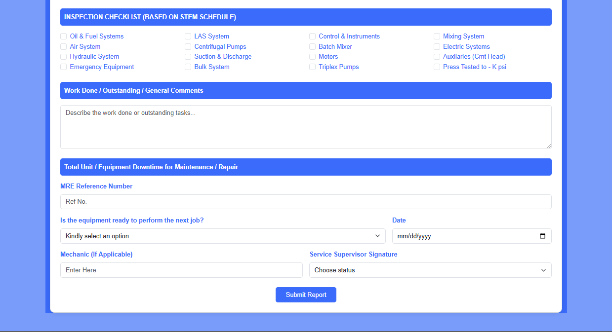

# B.G. TECHNICAL LIMITED

**STEM and Repair Report Form 🛠️**

This project presents a **comprehensive, responsive, and professional STEM and Repair Report Form** developed for **B.G. Technical Limited**, a Pipeline Flow Assurance Company. The form is designed to support efficient **maintenance reporting, equipment tracking, and quality assurance workflows** across all field operations. ✅

---

## **STEM AND REPAIR REPORT** 📋

### Key Features 🌟

* **STEM-Based Workflow Integration**: Follows BGT’s standardized STEM schedule to ensure equipment compliance, repair traceability, and preventive maintenance.
* **Equipment Data Capture**: Captures detailed information about engineers, units, serials, maintenance schedules, engine hours, and more.
* **Inspection Checklist**: Built-in inspection matrix mapped directly to the STEM schedule, covering key systems like hydraulics, pumps, mixing, and electrical systems.
* **Work Summary Section**: Allows field engineers to document actions taken, outstanding tasks, or general comments.
* **Downtime & Readiness Tracking**: Logs total equipment downtime and confirms readiness for next assignments through structured inputs.
* **Signature Workflow**: Includes supervisor sign-off and mechanic verification to validate field operations.
* **Responsive Layout**: Optimized for all devices—desktop, tablet, and mobile—for use in the field or at base.
* **Professional Styling**: Carries the branding identity of B.G. Technical Limited with structured layout and modern UI elements.

---

## **Visual Demo Previews** 📸

### Report Header Section

### Checklist Section

---

## **Topics Covered 🛠️**

1. **STEM Report Integration** – Creating standardized reports based on internal maintenance schedules.
2. **Responsive Form Design** – Ensuring usability across screen sizes for real-time reporting.
3. **Data Validation** – Ensuring form inputs are complete, valid, and clear.
4. **Field Accountability** – Embedding structured checklists and signatory roles.
5. **Corporate Branding** – Incorporating official BGT logo and style consistency.

---

## **Technologies Used** 🧩

* **HTML5** – Semantic structure and accessibility
* **CSS3** – Responsive and clean styling
* **Bootstrap 5** – Layout and component consistency
* *(Optional: JS or backend integration can be added later)*

---

## **How to Use the Form** 📥

1. **Start with Equipment Details** – Fill in all necessary fields about personnel and equipment.
2. **Complete Inspection Checklist** – Check all relevant systems inspected.
3. **Record Work Done & Downtime** – Capture findings, actions, and system availability.
4. **Confirm Readiness** – Indicate whether equipment is job-ready.
5. **Finalize with Signatures** – Select supervisor approval status and mechanic confirmation.
6. **Submit or Print** – Use the submit button or print the form for documentation.

---

## **Skills You’ll Learn** 💡

* Developing professional forms for **technical field operations**
* Structuring **responsive layouts** with Bootstrap
* Designing for **data clarity, traceability, and sign-off validation**
* Embedding branding into functional **technical documentation**

---

## Hashtags 🔖

\#STEMReport #FieldMaintenance #PipelineAssurance #ResponsiveDesign #HTML5 #Bootstrap5 #BGTLimited

---

**Thank you for exploring the STEM and Repair Report Form. This form streamlines inspection, improves accountability, and ensures B.G. Technical Limited maintains world-class pipeline assurance.** 🚀🛠️

